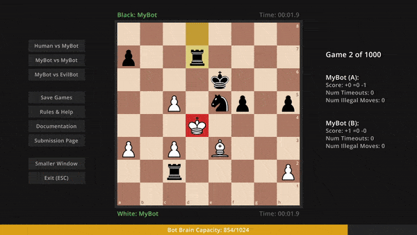

# ChessChallangeBot"# ChessBot01" 

My entry for Sebastian Lagues Tiny Chess Bot competition which can be found [here](https://github.com/SebLague/Chess-Challenge).

## My bot in action

It isn't the best due to it following the restrictions set by the competition, as well as my own lack of knowledge.
